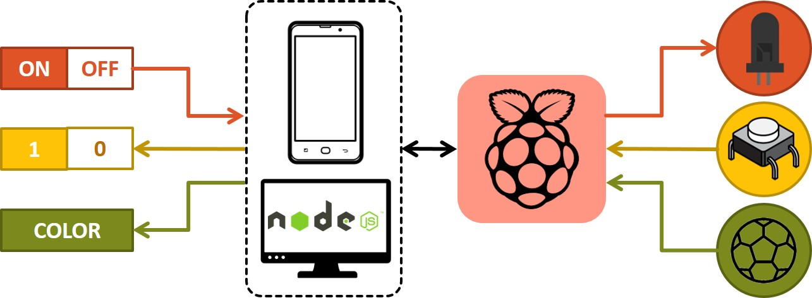
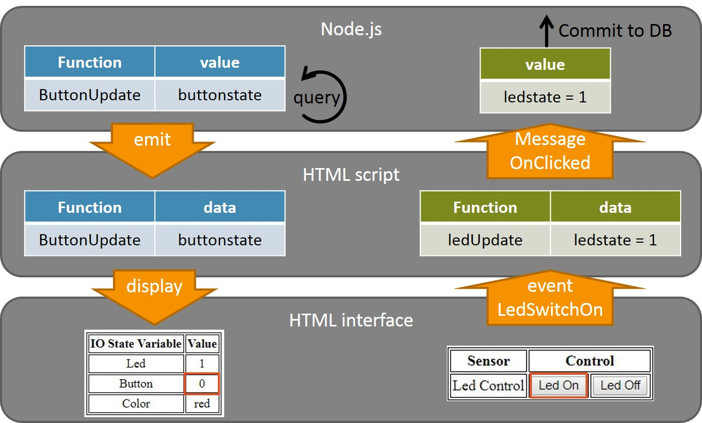

# Automation1062_Task6

For project setup please take a look at: https://github.com/wildcat5566/Automation1062_Task5  

## Task requests
  
- Control LED on / off  
- Read button state  
- Display object color  

## Event handling procedure
  
